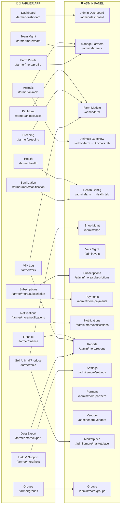
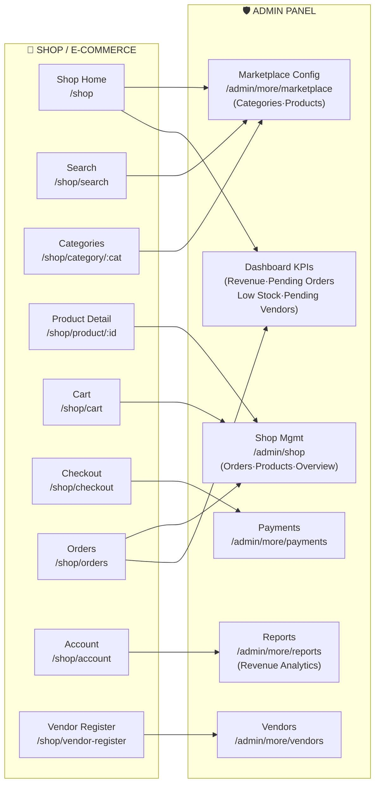
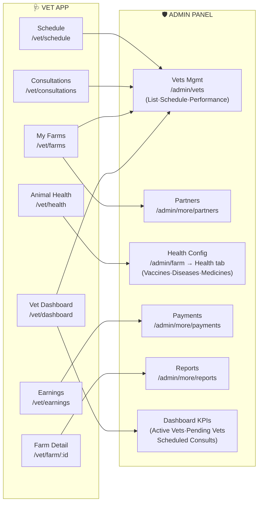

# Rumeno App — Frontend Feature → Admin Panel Mapping

> Generated: March 27, 2026  
> Total Screens: ~70 (Farmer: 32, Admin: 19, Shop: 11, Vet: 8)

---

## 1. Farmer App → Admin Panel

---

## 2. Shop / E-Commerce → Admin Panel

---

## 3. Vet App → Admin Panel

---

## 4. Detailed Feature-to-Admin Mapping Table

### Farmer Features

| # | Frontend Feature | Route | Admin Section | Admin Route | Status |
|---|---|---|---|---|---|
| 1 | Animal List & Detail | `/farmer/animals` | Farm → Animals tab | `/admin/farm` | ✅ Covered |
| 2 | Add Animal | `/farmer/animals/add` | Farm → Animals tab | `/admin/farm` | ✅ Covered |
| 3 | Kid Management | `/farmer/animals/kids` | Farm → Kids tab | `/admin/farm` | ✅ Covered |
| 4 | Vaccination Records | `/farmer/health/vaccination` | Farm → Health tab + Health Config | `/admin/farm` | ✅ Covered |
| 5 | Treatment Records | `/farmer/health/treatment` | Farm → Health tab + Health Config | `/admin/farm` | ✅ Covered |
| 6 | Deworming Records | `/farmer/health/deworming` | Farm → Health tab + Health Config | `/admin/farm` | ✅ Covered |
| 7 | Lab Reports | `/farmer/health/lab-reports` | Farm → Health tab | `/admin/farm` | ✅ Covered |
| 8 | Breeding Dashboard | `/farmer/breeding` | Farm → Breeding tab | `/admin/farm` | ✅ Covered |
| 9 | Milk Logging | `/farmer/milk` | Farm → Milk tab | `/admin/farm` | ✅ Covered |
| 10 | Finance / Expenses | `/farmer/finance` | Farm → Finance tab + Reports | `/admin/farm` + `/admin/more/reports` | ✅ Covered |
| 11 | Feed Calculator | `/farmer/finance/feed-calculator` | Reports (partial) | `/admin/more/reports` | ⚠️ No admin config for feed formulas |
| 12 | Groups | `/farmer/groups` | Groups | `/admin/more/groups` | ✅ Covered |
| 13 | Subscription Plans | `/farmer/more/subscription` | Subscriptions + Payments | `/admin/more/subscriptions` | ✅ Covered |
| 14 | Team Management | `/farmer/more/team` | Farmers list | `/admin/farmers` | ⚠️ No dedicated admin team oversight |
| 15 | Notification Settings | `/farmer/more/notifications` | Notifications | `/admin/more/notifications` | ✅ Covered |
| 16 | Data Export | `/farmer/more/export` | Reports | `/admin/more/reports` | ✅ Covered |
| 17 | Farm Sanitization | `/farmer/more/sanitization` | Health Config (partial) | `/admin/farm` | ⚠️ No admin sanitization protocols |
| 18 | Farm Profile | `/farmer/more/profile` | Farmers list | `/admin/farmers` | ✅ Covered |
| 19 | Help & Support | `/farmer/more/help` | Settings | `/admin/more/settings` | ⚠️ No admin FAQ/content management |
| 20 | Sell Animal/Produce | `/farmer/sale/*` | Shop + Marketplace | `/admin/shop` | ⚠️ No admin moderation for farmer listings |

### Shop Features

| # | Frontend Feature | Route | Admin Section | Admin Route | Status |
|---|---|---|---|---|---|
| 21 | Product Catalog | `/shop` | Shop → Products tab | `/admin/shop` | ✅ Covered |
| 22 | Categories | `/shop/category/:cat` | Marketplace Config | `/admin/more/marketplace` | ✅ Covered |
| 23 | Cart & Checkout | `/shop/cart`, `/shop/checkout` | Shop → Orders tab | `/admin/shop` | ✅ Covered |
| 24 | Order Tracking | `/shop/orders`, `/shop/order/:id` | Shop → Orders tab | `/admin/shop` | ✅ Covered |
| 25 | Coupons | (applied in cart) | Shop → Coupons tab | `/admin/shop` | ✅ Covered |
| 26 | Product Reviews | `/shop/product/:id` | Shop → Reviews tab | `/admin/shop` | ✅ Covered |
| 27 | Vendor Registration | `/shop/vendor-register` | Vendors | `/admin/more/vendors` | ✅ Covered |
| 28 | Delivery Tracking | `/shop/order/:id` | Shop → Delivery tab | `/admin/shop` | ✅ Covered |
| 29 | Stock Management | (product detail) | Shop → Stock Alerts tab | `/admin/shop` | ✅ Covered |

### Vet Features

| # | Frontend Feature | Route | Admin Section | Admin Route | Status |
|---|---|---|---|---|---|
| 30 | Vet Dashboard | `/vet/dashboard` | Vets Management | `/admin/vets` | ✅ Covered |
| 31 | Farm Visits | `/vet/farms` | Vets → List tab | `/admin/vets` | ✅ Covered |
| 32 | Consultations | `/vet/consultations` | Vets → Schedule tab | `/admin/vets` | ✅ Covered |
| 33 | Vet Schedule | `/vet/schedule` | Vets → Schedule tab | `/admin/vets` | ✅ Covered |
| 34 | Vet Performance | (dashboard stats) | Vets → Performance tab | `/admin/vets` | ✅ Covered |
| 35 | Vet Earnings | `/vet/earnings` | Payments | `/admin/more/payments` | ✅ Covered |

---

## 5. Admin Dashboard KPI Coverage

| KPI on Admin Dashboard | Data Source (Frontend Feature) |
|---|---|
| Shop Revenue | Shop orders (delivered) |
| Pending Orders Count | Shop orders (pending status) |
| Pending Vendors Count | Vendor registrations |
| Low Stock Count (≤10 units) | Product stock quantities |
| Active Vets Count | Vet profiles |
| Pending Vets Count | Vet registrations |
| Scheduled Consultations | Vet consultations |
| Overdue Vaccinations | Farmer health records |
| Active Treatments | Farmer health records |
| Overdue Group Alerts | Farmer groups |

---

## 6. Admin Panel Screens — Complete Inventory

### Main Navigation (6 tabs)

| Tab | Screen | Route | Tabs/Sections |
|---|---|---|---|
| Home | AdminDashboardScreen | `/admin/dashboard` | KPI cards, alerts, trends |
| Farmers | AdminFarmersScreen | `/admin/farmers` | Farmer list with plan filtering |
| Farm | AdminFarmScreen | `/admin/farm` | Animals, Health, Breeding, Milk, Kids, Finance (7 tabs) |
| Shop | AdminShopScreen | `/admin/shop` | Overview, Products, Orders, Vendors, Coupons, Delivery, Reviews, Stock Alerts (8 tabs) |
| Vets | AdminVetsScreen | `/admin/vets` | List, Consultations, Partners, Schedule, Performance (5 tabs) |
| More | AdminMoreScreen | `/admin/more` | Grid of sub-screens |

### More Sub-screens (9 screens)

| Screen | Route | Purpose |
|---|---|---|
| Subscriptions | `/admin/more/subscriptions` | Plan/tier management (Free, Starter, Pro, Business) |
| Payments | `/admin/more/payments` | Billing, transactions, revenue tracking |
| Partners | `/admin/more/partners` | Vet partnerships |
| Notifications | `/admin/more/notifications` | Push notifications to user segments |
| Reports | `/admin/more/reports` | Revenue, users, health analytics |
| Settings | `/admin/more/settings` | App config (maintenance, signups, language) |
| Vendors | `/admin/more/vendors` | Vendor approval & management |
| Marketplace | `/admin/more/marketplace` | Product & category configuration |
| Groups | `/admin/more/groups` | Farmer group management |

---

## 7. Gap Analysis — What's Missing

### 🔴 High Priority Gaps

| Gap | Frontend Feature | What's Missing in Admin |
|-----|-----|-----|
| Feed Calculator Config | Farmer can calculate feed costs | No admin screen to configure feed formulas, ingredient prices, or nutritional tables |
| Farm Sanitization Protocols | Farmer tracks sanitization records | No admin screen to manage sanitization protocols, schedules, or compliance standards |

### 🟡 Medium Priority Gaps

| Gap | Frontend Feature | What's Missing in Admin |
|-----|-----|-----|
| Help & Support CMS | Farmer sees FAQ and help articles | No admin screen to manage FAQ content, support tickets, or help articles |
| Team Oversight | Farmers manage their farm staff | Admin can see farmers but no view of farm teams/staff roles across all farms |
| Farmer Sale Moderation | Farmers can sell animals/produce | No admin approval/moderation flow for farmer-to-farmer sale listings |
| Localization Management | App supports multiple languages | Admin settings has language dropdown but no translation management screen |

### ✅ Fully Covered (29/35 features)

All core farm management, health tracking, ecommerce, and vet features have corresponding admin panel sections for configuration, monitoring, and management.
